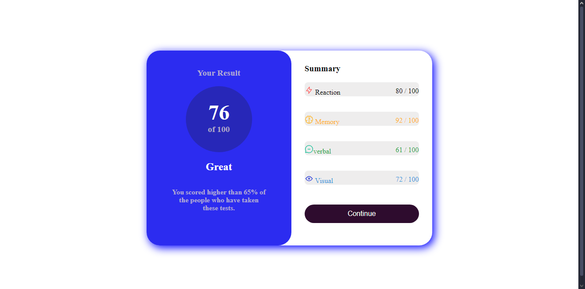
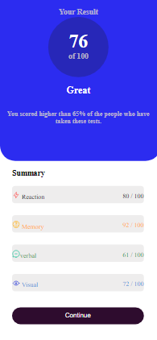

# Frontend Mentor - Results summary component solution

This is a solution to the [Results summary component challenge on Frontend Mentor](https://www.frontendmentor.io/challenges/results-summary-component-CE_K6s0maV). Frontend Mentor challenges help you improve your coding skills by building realistic projects. 

## Table of contents
  - [Screenshot](#screenshot)
  - [Links](#links)
  - [My process](#my-process)
  - [Built with](#built-with)
  - [What I learned](#what-i-learned)
  - [Continued development](#continued-development)
  - [Author](#author)
  - [Acknowledgments](#acknowledgments)

### Screenshot

### Links

- Solution URL: [solution URL here](https://github.com/Rustom0/project3.git)
- Live Site URL: [live site URL here](https://rustom0.github.io/project3/)

## My process
first made the layout for desktop verson use flex and then made a layout for mobile version and then start flling it.

### Built with

- Semantic HTML5 markup
- CSS custom properties
- Flexbox

### What I learned
More about changing sites to desktop and mobile verison first time dealing with seomething like this.

### Continued development
i like how competative responsive can be so like to improve in those features.

## Author

- Frontend Mentor - [@Rustom dewan](https://www.frontendmentor.io/profile/Rustom0)
